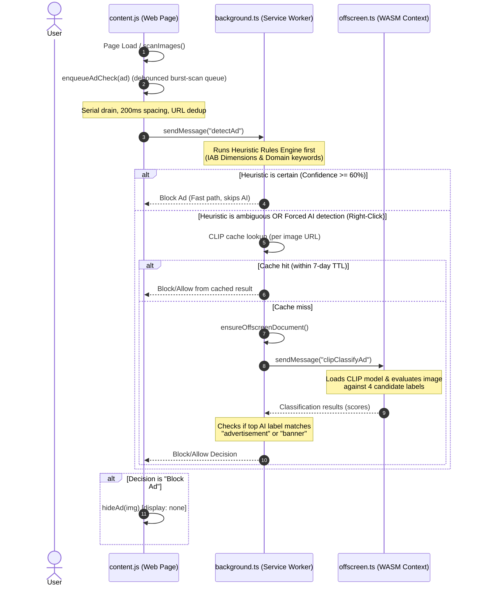

# 🛡️ AI Vision & Heuristic Ad Blocker

An intelligent, on-device Chromium extension for Google Chrome, Microsoft Edge, Brave, and compatible Chromium browsers. It blocks advertisements using a **hybrid engine** combining fast heuristics with a local **CLIP Zero-Shot Vision Transformer (ViT)** running in WebAssembly.

---

## 🚀 Key Features

*   **Hybrid Ad Detection Engine**:
    *   **Tier 1: Heuristics** (Instant evaluation based on IAB standard sizes, banner aspect ratios, and domain/URL rules).
    *   **Tier 2: local CLIP AI Vision** (OpenAI's Vision Transformer `CLIP-ViT-B/16` runs zero-shot classification in an offscreen WASM worker when heuristics are ambiguous).
*   **Request-Level Blocking (declarativeNetRequest)**: Known ad domains are blocked at the network layer, not just hidden in the DOM—saves bandwidth and catches `window.open` popups before they fire.
*   **On-Demand AI Detection (Context Menu)**: Right-click any image on the web and select **"✨ Analyze with AI & Detect Ad"** to review the classification reasons and confidence scores.
*   **CLIP Result Cache**: AI classification results are cached per image URL (7-day TTL, LRU), so repeat scans cost nothing.
*   **Burst-Scan Queue**: Image scans are queued and debounced to keep ad-heavy pages from overwhelming the tab or the AI runtime.
*   **Safe Iframe Hiding**: Ad iframes (such as Google Ads, Admicro, DoubleClick, etc.) are hidden safely at the element level to avoid breaking parent layouts.
*   **Dynamic Rule Updates**: Ad domains, URL keywords, and ad-container selectors can be updated from [`rules/ad-rules.json`](rules/ad-rules.json) in this repository. Rules are cached locally for 24 hours and built-in rules remain available offline.
*   **Selectable Vision Model**: The popup can select the reliable CLIP model or an experimental MobileNetV4 fast classifier. CLIP is the default because MobileNet currently uses general ImageNet weights rather than ad-specific fine-tuning.
*   **CSS/HTML Ad Takeover Detection**: Detects ad creatives that render without image elements, including ADBRO, top-banner, top-fish, and PlayStream containers.
*   **JW Player Ad Handling**: Detects JW Player ad countdowns, mutes video during the countdown, automatically clicks the enabled **Skip Ad** button, and restores the previous audio state.
*   **Clean Page Cleanup**: Auto-collapses empty container placeholders left behind by image banner ads.
*   **100% Local & Privacy-First**: All AI inference runs locally in your browser's offscreen WebAssembly runtime—no visual data ever leaves your device.

---

## 🛠️ How It Works (Architecture)



> **Request-level blocking** is handled separately: `background.ts` installs dynamic `declarativeNetRequest` rules that block known ad domains at the network layer, so `window.open`-style popups never get a chance to render.

### 1. Zero-Shot Image Classification
The extension uses Apple/OpenAI's **CLIP** model (`Xenova/clip-vit-base-patch16-224`) inside a Chromium Offscreen Document. It dynamically tests images against these candidate labels:
*   `"gambling advertisement banner"`
*   `"promotional ad banner"`
*   `"sports betting banner"`
*   `"regular website photo or graphic"`

---

## Install

- **Google Chrome / Brave:** install from the Chrome Web Store listing.
- **Microsoft Edge:** install from Microsoft Edge Add-ons.
- **Generic Chromium / development:** download the GitHub Release ZIP or build locally and load `dist/` as an unpacked extension.

All channels use the same extension version and the same release package. A single `vX.Y.Z` Git tag drives GitHub, Edge, and Chrome publishing.

## 📦 Local Development & Setup

### Prerequisites
*   Node.js 20+
*   npm

### 1. Clone the repository
```bash
git clone https://github.com/dhhieu113pro/adblocker-extension.git
cd adblocker-extension
```

### 2. Install dependencies
```bash
npm install
```

### 3. Build the extension
For development (watches files for changes):
```bash
npm run dev
```

For production (bundles and copies WASM dependencies):
```bash
npm run build
```

### 4. Load unpacked
1. Open your Chromium browser's extensions page (for Chrome: `chrome://extensions/`).
2. Enable **Developer mode**.
3. Click **Load unpacked**.
4. Select the `dist/` directory from this project folder.

### Remote ad rules

The extension loads the latest rules from:

```text
https://raw.githubusercontent.com/dhhieu113pro/adblocker-extension/main/rules/ad-rules.json
```

The loader validates the response, applies cached rules when available, refreshes at most once per day, and falls back to the bundled rules if GitHub is unavailable. The remote file contains:

*   Known ad domains
*   Strong URL keywords
*   CSS selectors for injected ad containers

To publish a rule update, edit `rules/ad-rules.json`, commit it, and push it to the repository.

---

## 💡 How to Use

### Automatic Ad Blocking
*   Once loaded, the extension actively monitors the active tab.
*   Standard ad banners, promotional skyscrapers, and ad iframes will be blocked and hidden automatically.
*   Dynamically injected banners and CSS-based takeover ads are rescanned when their containers, classes, or lazy-loaded URLs change.

### Vision model selection

Open the extension popup and choose **Vision Model**:

*   **CLIP Vision**: Recommended zero-shot model for general ad classification.
*   **MobileNetV4 Fast**: Experimental lightweight classifier. It is useful for testing fast inference, but ad-specific training is still recommended for production accuracy.

### On-Demand AI Inspector
1.  Find any image on a website.
2.  Right-click the image.
3.  Select **"✨ Analyze with AI & Detect Ad"**.
4.  An interactive modal will appear showing the classification confidence (e.g. `94% confidence`) and a list of reasoning details behind the evaluation.
5.  You can manually toggle container visibility from the modal if needed.

---

## 📄 License
This project is licensed under the MIT License - see the LICENSE file for details.
